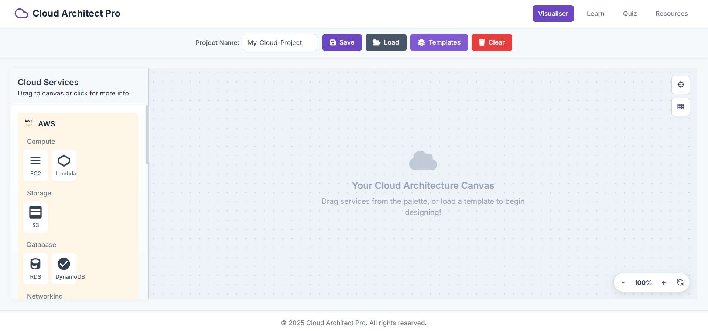
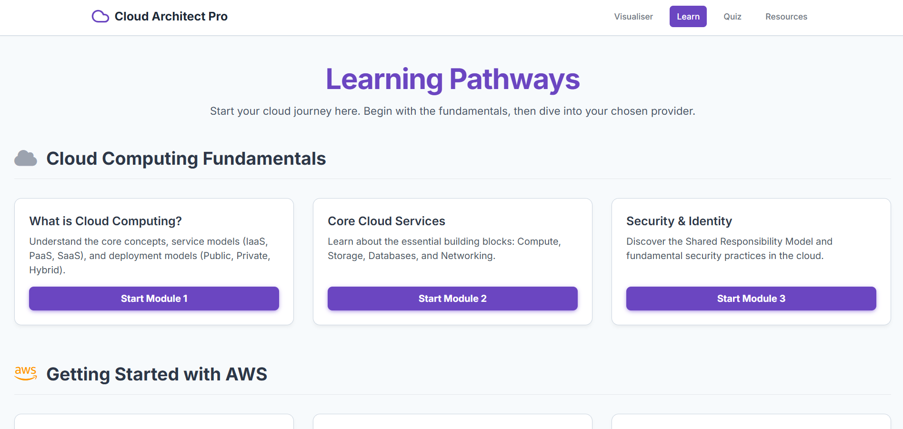
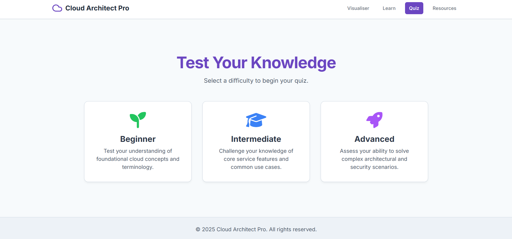
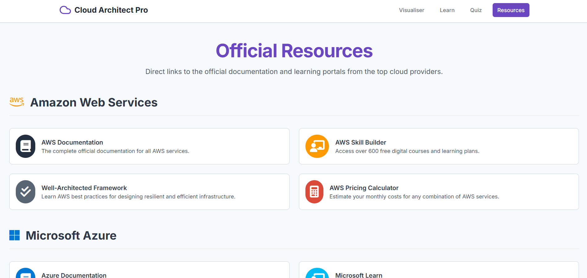

# 🌩️ Cloud Architect Pro

[](LICENCE)


**Cloud Architect Pro** is a modern, interactive web application for **visualising, learning, and testing knowledge of cloud architecture** across **AWS**, **Azure**, and **Google Cloud Platform**.

Designed for **aspiring cloud architects, students, and professionals in the United Kingdom and beyond**.

---

## 📑 Table of Contents

* [Overview](#-overview)
* [Features](#-features)
* [Screenshots](#-screenshots)
* [Live Demo](#-live-demo)
* [Getting Started](#-getting-started)
* [Project Structure](#-project-structure)
* [Technologies Used](#-technologies-used)
* [Accessibility & Design](#-accessibility--design)
* [Contributing](#-contributing)
* [Licence](#-licence)
* [Acknowledgements](#-acknowledgements)

---

## 🌟 Overview

**Cloud Architect Pro** is a comprehensive, browser-based platform that combines:

* 🖱️ An **interactive visualiser** for designing cloud architectures.
* 📘 **Structured learning pathways** covering fundamentals and provider-specific knowledge.
* 🎯 A **quiz engine** to test your understanding at different levels.
* 🔗 **Curated resources** linking directly to AWS, Azure, and GCP official documentation.

All terminology is presented in **UK English** for consistency and accessibility.

---

## 🚀 Features

* **Visualiser** – Drag-and-drop interface for building cloud diagrams and exploring templates.
* **Learn** – Guided modules covering **cloud basics, AWS, Azure, and GCP**.
* **Quiz** – Select difficulty levels, answer UK English questions, and get instant feedback.
* **Resources** – Direct access to provider documentation, learning hubs, and calculators.
* **Responsive Design** – Works seamlessly on desktop and mobile.
* **Accessible UI** – Screen reader support, keyboard navigation, and ARIA labels.

---

## 🖼️ Screenshots

| Visualiser                                      | Learning Pathways                                 | Quiz Engine                                | Resources Hub                                     |
| ----------------------------------------------- | ------------------------------------------------- | ------------------------------------------ | ------------------------------------------------- |
|  |  |  |  |


## 🌐 Live Demo

Run locally by opening `https://sanilpanchal23.github.io/Cloud-Architect-Pro/` in your browser.
No backend or installation is required — everything runs client-side.

---

## 🛠️ Getting Started

1. **Clone the repository**:

   ```bash
   git clone <(https://github.com/Sanilpanchal23/Cloud-Architect-Pro)>
   cd Cloud-Architect-Pro
   ```

2. **Open in your browser**:

   * Visit or type `(https://sanilpanchal23.github.io/Cloud-Architect-Pro/)`

3. **No installation required**:

   * Dependencies (Tailwind CSS, Font Awesome, Google Fonts) are loaded via CDN

---

## 📂 Project Structure

```
Cloud-Architect-Pro/
├── index.html        # Visualiser (main app)
├── learn.html        # Learning pathways and modules
├── quiz.html         # Quiz engine for cloud knowledge
├── resources.html    # Curated official links
├── assets/           # Screenshots and media
├── README.md         # Project documentation
```

---

## ⚙️ Technologies Used

* **HTML5** – Semantic, accessible structure
* **Tailwind CSS** – Responsive and utility-first design
* **Font Awesome** – Icons for providers and UI
* **Google Fonts (Inter)** – Clean, modern typography
* **Vanilla JavaScript** – Interactivity, quiz engine, modals, state handling

---

## ♿ Accessibility & Design

* **UK English** throughout
* **Keyboard Navigation** (Tab, Enter, Escape support)
* **ARIA Roles & Labels** for accessibility tools
* **High Contrast Colour Palette** (WCAG compliant)
* **Responsive Layouts** optimised for mobile and desktop

---

## 🤝 Contributing

Contributions are welcome:

1. Fork the repository
2. Create a branch for your feature/fix
3. Ensure **UK English** is used consistently
4. Submit a pull request with a clear description

For larger changes, please open an issue first for discussion.

---

## 📜 Licence

Released under the **MIT Licence**.
See [LICENCE](LICENCE) for full details.

---

## 🙏 Acknowledgements

* **AWS, Microsoft Azure, Google Cloud Platform** – Official resources and documentation
* **Tailwind CSS, Font Awesome, Google Fonts** – Open-source design frameworks

---

✨ **Cloud Architect Pro – Visualising the Cloud, Learning the Fundamentals, and Testing Your Knowledge.**


